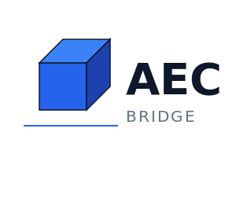

<div align="center">



# AEC Model Bridge

Independent Model Context Protocol integration for Autodesk Revit® software.

[](https://github.com/Sam-AEC/Autodesk-Revit-MCP-Server/releases)
[](https://github.com/Sam-AEC/Autodesk-Revit-MCP-Server/releases/latest)
[](https://github.com/Sam-AEC/Autodesk-Revit-MCP-Server/stargazers)
[](https://github.com/Sam-AEC/Autodesk-Revit-MCP-Server/forks)
[](https://github.com/Sam-AEC/Autodesk-Revit-MCP-Server/commits/main/)
[](LICENSE)
[](https://www.python.org/)
[](https://www.autodesk.com/products/revit/)

[Quick start](#quick-start) | [Tools](docs/tools.md) | [Architecture](docs/architecture.md) | [Security](docs/security.md)

</div>

## What This Project Does

This repository connects MCP clients such as Claude Desktop, VS Code, and custom agents to Autodesk Revit.

It has two runtime components:

- A Python MCP server that exposes tools to the AI client.
- A C# Revit add-in that executes commands on Revit's main thread through `ExternalEvent`.

The bridge currently implements 103 active command routes across model authoring, documentation, parameters, views, sheets, exports, worksharing, MEP, structure, geometry, and model inspection.

## Repository Growth

The download badge reports the cumulative number of GitHub release-asset downloads. GitHub does not include clones or automatically generated source archives in that total.

<div align="center">
  <a href="https://star-history.com/#Sam-AEC/Autodesk-Revit-MCP-Server&Date">
    <picture>
      <source media="(prefers-color-scheme: dark)" srcset="https://api.star-history.com/svg?repos=Sam-AEC/Autodesk-Revit-MCP-Server&type=Date&theme=dark">
      <source media="(prefers-color-scheme: light)" srcset="https://api.star-history.com/svg?repos=Sam-AEC/Autodesk-Revit-MCP-Server&type=Date">
      
    </picture>
  </a>
</div>

The chart is generated by the open-source [Star History](https://github.com/star-history/star-history) service and shows repository interest over time. GitHub does not provide a public historical time series for release downloads, so download growth cannot be reconstructed retroactively.

## Why Use It

- Direct Revit API execution without requiring pyRevit or Dynamo.
- Localhost bridge with Revit-safe main-thread dispatch.
- Typed tools for common BIM operations.
- Reflection and in-process Python escape hatches for advanced workflows.
- Mock mode for development and testing without Revit.
- Version-specific builds for Revit 2024 through Revit 2027.

## Compatibility

| Revit | Add-in target | Status |
|---|---|---|
| 2024 | .NET Framework 4.8 | Supported |
| 2025 | .NET 8 for Windows | Supported |
| 2026 | .NET 8 for Windows | Supported |
| 2027 | .NET 10 for Windows | Supported |

Revit 2027 support is compiled against the installed Autodesk Revit 2027 API assemblies.

## Quick Start

### Prerequisites

- Windows 10 or 11
- Autodesk Revit 2024-2027
- Python 3.11 or later
- The .NET SDK required by the selected Revit version

### 1. Clone and install the MCP server

```powershell
git clone https://github.com/Sam-AEC/Autodesk-Revit-MCP-Server.git
cd Autodesk-Revit-MCP-Server
pip install -e packages/mcp-server-revit
```

### 2. Build, package, and install the Revit add-in

For Revit 2027:

```powershell
.\scripts\build-addin.ps1 -RevitVersion 2027
.\scripts\package.ps1 -RevitVersion 2027
.\scripts\install.ps1 -RevitVersion 2027
```

The installer places:

- Binaries in `C:\ProgramData\AECModelBridge\bin`
- The manifest in `%APPDATA%\Autodesk\Revit\Addins\2027`
- Default configuration in `C:\ProgramData\AECModelBridge\config`

Restart Revit after installing or replacing the add-in.

### 3. Configure an MCP client

Example Claude Desktop configuration:

```json
{
  "mcpServers": {
    "revit": {
      "command": "python",
      "args": ["-m", "revit_mcp_server.mcp_server"],
      "env": {
        "MCP_REVIT_BRIDGE_URL": "http://127.0.0.1:3000",
        "MCP_REVIT_MODE": "bridge"
      }
    }
  }
}
```

The repository also includes [`.vscode/mcp.json`](.vscode/mcp.json) for VS Code and GitHub Copilot.

### 4. Verify the bridge

Start Revit, then run:

```powershell
Invoke-RestMethod http://127.0.0.1:3000/health
```

For Revit 2027, the response should include:

```json
{
  "status": "healthy",
  "revit_version": "2027"
}
```

## Architecture

```text
MCP client
    |
    | stdio / MCP
    v
Python MCP server
    |
    | HTTP on 127.0.0.1:3000
    v
C# Revit bridge add-in
    |
    | ExternalEvent on Revit main thread
    v
Autodesk Revit API
```

The HTTP listener receives requests off the Revit UI thread. Commands are queued and executed through `ExternalEvent`, which is required for safe Revit API access.

## Tool Coverage

The active bridge command surface includes:

- Documents, levels, grids, walls, floors, roofs, rooms, and families
- Parameters, project parameters, shared parameters, and batch updates
- Views, view templates, sheets, title blocks, schedules, and annotations
- Selection, transforms, groups, links, worksets, and synchronization
- Structural columns, beams, foundations, ducts, pipes, and conduits
- PDF, DWG, IFC, Navisworks, schedule, image, and rendering exports
- Warnings, quantities, clashes, geometry, bounding boxes, and model queries
- Reflection-based API calls and in-process Python execution

See [docs/tools.md](docs/tools.md) for the tool reference.

## Security

The bridge listens on `127.0.0.1` by default. Do not expose port `3000` to a network without authentication and transport security.

The `execute_python`, `invoke_method`, `reflect_get`, and `reflect_set` tools are privileged capabilities. They can modify the active model and execute broad API operations. Restrict them in shared or production environments and keep backups of important models.

See [docs/security.md](docs/security.md) for the security model and [SECURITY.md](SECURITY.md) for vulnerability reporting.

## Current Limitations

- Some source directories are excluded from compilation while their APIs are stabilized.
- Experimental command implementations are not advertised until they are active in the bridge.
- Automated tests cover the Python server; full Revit integration testing still requires a licensed Windows/Revit environment.
- Release download counts include GitHub release assets only. Git clones and GitHub-generated source archives are not counted.

## Development

Run the Python test suite:

```powershell
python -m pytest packages/mcp-server-revit/tests
```

Build a specific Revit add-in:

```powershell
.\scripts\build-addin.ps1 -RevitVersion 2027 -Configuration Release
```

Package all supported versions:

```powershell
.\scripts\package.ps1 -RevitVersion All
```

## Documentation

- [Installation](docs/install.md)
- [Tool reference](docs/tools.md)
- [Architecture](docs/architecture.md)
- [Configuration reference](docs/configuration-reference.md)
- [Build and install scripts](docs/build-and-install-scripts.md)
- [Target frameworks and dependencies](docs/target-frameworks-and-dependencies.md)
- [MCP marketplaces](docs/marketplaces.md)
- [Contributing](CONTRIBUTING.md)

## License

This repository is currently distributed under the [MIT License](LICENSE).

## Trademark and Affiliation Notice

AEC Model Bridge is an independent project. It is not sponsored, endorsed, or
provided by Autodesk.

Autodesk and Revit are trademarks of the Autodesk group of companies. Sam-AEC
is not affiliated with Autodesk.

The project uses the documented Revit desktop API and does not distribute
Autodesk API assemblies, product icons, or other Autodesk software. Users must
provide their own properly licensed installation. See [TRADEMARKS.md](TRADEMARKS.md).
