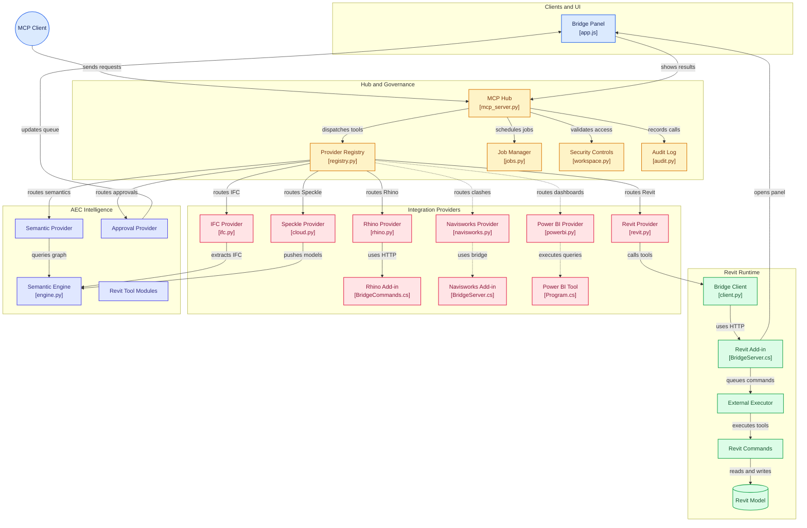

<div align="center">


# AEC Model Bridge

AEC Model Bridge is the open, secure runtime that puts Revit, Rhino, Navisworks, and Power BI behind one MCP call center — so an AI agent orchestrates them directly, instead of you manually dumping data between disconnected apps.


[](https://registry.modelcontextprotocol.io/?q=io.github.Sam-AEC%2Faec-model-bridge)
[](LICENSING.md)
[](https://www.python.org/)
[](https://www.autodesk.com/products/revit/)

<br>
<strong>Available now</strong><br>


<strong>In progress</strong><br>


<strong>Coming soon</strong><br>


[Install](#installation) | [Tools](docs/tools-generated.md) | [Documentation](#documentation) | [Latest release](https://github.com/Sam-AEC/aec-model-bridge/releases/latest)

</div>

A single MCP client — Claude Desktop, VS Code, GitHub Copilot, or a custom
agent — talks to one Python hub, and the hub routes each call to whichever
app the task actually needs: draw geometry in Rhino, query parameters in
Revit, resolve clashes in Navisworks, publish a dashboard to Power BI. The
agent plans the workflow once; the bridge is what lets it reach every app
without you being the one copying data between them.

The Python hub handles MCP communication and routes each request to the relevant
desktop, headless, cloud, or compute provider:
- **Revit**: Native C# add-in (Revit 2024-2027) executing on the main thread via `ExternalEvent`.
- **Navisworks Manage**: Native C# add-in (Navisworks 2024-2027) exposing the API over a local bridge (in progress).
- **Rhino/Grasshopper**: Connects to the Rhino Bridge Add-in over HTTP localhost:3004.
- **Speckle**: Native Python provider integrating Specklepy V3 for seamless model pushing to Power BI.
- **IfcOpenShell**: Headless IFC semantic extraction and parsing.

## Platform Status

The status below reflects the AEC Model Bridge system blueprint as of June 2026.
In-progress integrations are implemented as routing infrastructure but require further registration or workflow integration.

### Available Now

Revit, Rhino/Grasshopper, IfcOpenShell, and Speckle are available integrations. The Revit C# add-in (Revit 2024-2027) executes commands on the main thread. Rhino connects to the Rhino Bridge Add-in over HTTP on port 3004. IfcOpenShell provides headless IFC parsing, and Speckle integrates model pushing via Specklepy V3.

### In Progress

Navisworks Manage is currently in progress; while the C# add-in routing infrastructure is in place, the provider is not yet registered in the shipped hub. Power BI is also in progress, with the provider and tool in place but not yet integrated into the active hub runtime.

### Coming Soon

This wave adds Excel workbook round trips and a Parquet/DuckDB data plane for cross-platform reporting.

## Highlights

- 100+ MCP tools for model authoring, documentation, parameters, views, sheets, exports, and QA.
- Native Revit & Navisworks add-ins with no Dynamo or pyRevit dependencies.
- Multi-platform synchronization: Cross-query Navisworks clash results, Revit parameters, and Rhino models dynamically.
- Speckle and PowerBI automated data handoffs.
- Async job orchestration and centralized PII redaction.
- Reflection and in-process Python for advanced API workflows.
- Localhost-only bridge by default for absolute security.
- Mock mode for development and automated testing without Revit.

## How It Works


```mermaid
flowchart TD

subgraph group_clients["Clients and UI"]
  node_panel_ui["Bridge Panel<br/>[app.js]"]
end

subgraph group_hub["Hub and Governance"]
  node_mcp_hub["MCP Hub<br/>[mcp_server.py]"]
  node_provider_registry["Provider Registry<br/>[registry.py]"]
  node_job_manager["Job Manager<br/>[jobs.py]"]
  node_security_controls["Security Controls<br/>[workspace.py]"]
  node_audit_log["Audit Log<br/>[audit.py]"]
end

subgraph group_revit["Revit Runtime"]
  node_revit_bridge_client["Bridge Client<br/>[client.py]"]
  node_revit_addin["Revit Add-in<br/>[BridgeServer.cs]"]
  node_external_executor["External Executor"]
  node_revit_commands["Revit Commands"]
  node_revit_model[("Revit Model")]
end

subgraph group_providers["Integration Providers"]
  node_revit_provider["Revit Provider<br/>[revit.py]"]
  node_rhino_provider["Rhino Provider<br/>[rhino.py]"]
  node_rhino_addin["Rhino Add-in<br/>[BridgeCommands.cs]"]
  node_ifc_provider["IFC Provider<br/>[ifc.py]"]
  node_speckle_provider["Speckle Provider<br/>[cloud.py]"]
  node_navisworks_provider["Navisworks Provider<br/>[navisworks.py]"]
  node_navisworks_addin["Navisworks Add-in<br/>[BridgeServer.cs]"]
  node_powerbi_provider["Power BI Provider<br/>[powerbi.py]"]
  node_powerbi_tool["Power BI Tool<br/>[Program.cs]"]
end

subgraph group_intelligence["AEC Intelligence"]
  node_semantic_provider["Semantic Provider"]
  node_semantic_engine["Semantic Engine<br/>[engine.py]"]
  node_revit_modules["Revit Tool Modules"]
  node_approval_provider["Approval Provider"]
end

node_mcp_client(("MCP Client"))

node_mcp_client -->|"sends requests"| node_mcp_hub
node_panel_ui -->|"shows results"| node_mcp_hub
node_mcp_hub -->|"validates access"| node_security_controls
node_mcp_hub -->|"records calls"| node_audit_log
node_mcp_hub -->|"schedules jobs"| node_job_manager
node_mcp_hub -->|"dispatches tools"| node_provider_registry
node_provider_registry -->|"routes Revit"| node_revit_provider
node_provider_registry -->|"routes Rhino"| node_rhino_provider
node_provider_registry -->|"routes IFC"| node_ifc_provider
node_provider_registry -->|"routes Speckle"| node_speckle_provider
node_provider_registry -->|"routes semantics"| node_semantic_provider
node_provider_registry -->|"routes approvals"| node_approval_provider
node_provider_registry -.->|"routes clashes"| node_navisworks_provider
node_provider_registry -.->|"routes dashboards"| node_powerbi_provider
node_revit_provider -->|"calls tools"| node_revit_bridge_client
node_revit_bridge_client -->|"uses HTTP"| node_revit_addin
node_revit_addin -->|"queues commands"| node_external_executor
node_external_executor -->|"executes tools"| node_revit_commands
node_revit_commands -->|"reads and writes"| node_revit_model
node_revit_addin -->|"opens panel"| node_panel_ui
node_rhino_provider -->|"uses HTTP"| node_rhino_addin
node_ifc_provider -->|"extracts IFC"| node_semantic_engine
node_speckle_provider -->|"pushes models"| node_semantic_engine
node_navisworks_provider -.->|"uses bridge"| node_navisworks_addin
node_powerbi_provider -.->|"executes queries"| node_powerbi_tool
node_semantic_provider -->|"queries graph"| node_semantic_engine
node_approval_provider -->|"updates queue"| node_panel_ui

click node_panel_ui "https://github.com/Sam-AEC/aec-model-bridge/blob/main/panel/app.js"
click node_mcp_hub "https://github.com/Sam-AEC/aec-model-bridge/blob/main/packages/mcp-server-revit/src/revit_mcp_server/mcp_server.py"
click node_provider_registry "https://github.com/Sam-AEC/aec-model-bridge/blob/main/packages/mcp-server-revit/src/revit_mcp_server/providers/registry.py"
click node_job_manager "https://github.com/Sam-AEC/aec-model-bridge/blob/main/packages/mcp-server-revit/src/revit_mcp_server/jobs.py"
click node_security_controls "https://github.com/Sam-AEC/aec-model-bridge/blob/main/packages/mcp-server-revit/src/revit_mcp_server/security/workspace.py"
click node_audit_log "https://github.com/Sam-AEC/aec-model-bridge/blob/main/packages/mcp-server-revit/src/revit_mcp_server/security/audit.py"
click node_revit_provider "https://github.com/Sam-AEC/aec-model-bridge/blob/main/packages/mcp-server-revit/src/revit_mcp_server/providers/revit.py"
click node_revit_bridge_client "https://github.com/Sam-AEC/aec-model-bridge/blob/main/packages/mcp-server-revit/src/revit_mcp_server/bridge/client.py"
click node_revit_addin "https://github.com/Sam-AEC/aec-model-bridge/blob/main/packages/revit-bridge-addin/src/Bridge/BridgeServer.cs"
click node_external_executor "https://github.com/Sam-AEC/aec-model-bridge/blob/main/packages/revit-bridge-addin/src/Bridge/ExternalEventHandler.cs"
click node_revit_commands "https://github.com/Sam-AEC/aec-model-bridge/blob/main/packages/revit-bridge-addin/src/Bridge/BridgeCommandFactory.cs"
click node_rhino_provider "https://github.com/Sam-AEC/aec-model-bridge/blob/main/packages/mcp-server-revit/src/revit_mcp_server/providers/rhino.py"
click node_rhino_addin "https://github.com/Sam-AEC/aec-model-bridge/blob/main/packages/rhino-bridge-addin/src/BridgeCommands.cs"
click node_ifc_provider "https://github.com/Sam-AEC/aec-model-bridge/blob/main/packages/mcp-server-revit/src/revit_mcp_server/providers/ifc.py"
click node_speckle_provider "https://github.com/Sam-AEC/aec-model-bridge/blob/main/packages/mcp-server-revit/src/revit_mcp_server/providers/cloud.py"
click node_navisworks_provider "https://github.com/Sam-AEC/aec-model-bridge/blob/main/packages/mcp-server-revit/src/revit_mcp_server/providers/navisworks.py"
click node_navisworks_addin "https://github.com/Sam-AEC/aec-model-bridge/blob/main/packages/navisworks-bridge-addin/src/BridgeServer.cs"
click node_powerbi_provider "https://github.com/Sam-AEC/aec-model-bridge/blob/main/packages/mcp-server-revit/src/revit_mcp_server/providers/powerbi.py"
click node_powerbi_tool "https://github.com/Sam-AEC/aec-model-bridge/blob/main/packages/powerbi-bridge-tool/src/Program.cs"
click node_semantic_provider "https://github.com/Sam-AEC/aec-model-bridge/blob/main/packages/mcp-server-revit/src/revit_mcp_server/providers/semantic_provider.py"
click node_semantic_engine "https://github.com/Sam-AEC/aec-model-bridge/blob/main/packages/mcp-server-revit/src/revit_mcp_server/semantic/engine.py"
click node_revit_modules "https://github.com/Sam-AEC/aec-model-bridge/tree/main/packages/mcp-server-revit/src/revit_mcp_server/modules"
click node_approval_provider "https://github.com/Sam-AEC/aec-model-bridge/blob/main/packages/mcp-server-revit/src/revit_mcp_server/providers/approval_provider.py"

classDef toneNeutral fill:#f8fafc,stroke:#334155,stroke-width:1.5px,color:#0f172a
classDef toneBlue fill:#dbeafe,stroke:#2563eb,stroke-width:1.5px,color:#172554
classDef toneAmber fill:#fef3c7,stroke:#d97706,stroke-width:1.5px,color:#78350f
classDef toneMint fill:#dcfce7,stroke:#16a34a,stroke-width:1.5px,color:#14532d
classDef toneRose fill:#ffe4e6,stroke:#e11d48,stroke-width:1.5px,color:#881337
classDef toneIndigo fill:#e0e7ff,stroke:#4f46e5,stroke-width:1.5px,color:#312e81
classDef toneTeal fill:#ccfbf1,stroke:#0f766e,stroke-width:1.5px,color:#134e4a
class node_panel_ui,node_mcp_client toneBlue
class node_mcp_hub,node_provider_registry,node_job_manager,node_security_controls,node_audit_log toneAmber
class node_revit_bridge_client,node_revit_addin,node_external_executor,node_revit_commands,node_revit_model toneMint
class node_revit_provider,node_rhino_provider,node_rhino_addin,node_ifc_provider,node_speckle_provider,node_navisworks_provider,node_navisworks_addin,node_powerbi_provider,node_powerbi_tool toneRose
class node_semantic_provider,node_semantic_engine,node_revit_modules,node_approval_provider toneIndigo
```

## Installation

### Requirements

| Revit version | Add-in target | Required build tools |
|---|---|---|
| 2024 | .NET Framework 4.8 | .NET 8 SDK and .NET Framework 4.8 developer pack |
| 2025 | .NET 8 for Windows | .NET 8 SDK |
| 2026 | .NET 8 for Windows | .NET 8 SDK |
| 2027 | .NET 10 for Windows | .NET 10 SDK |

You also need Windows 10 or 11, Python 3.11 or later, and a licensed Revit
installation for the version you want to use.

### 1. Install the MCP server

```powershell
git clone https://github.com/Sam-AEC/aec-model-bridge.git
cd aec-model-bridge

py -m venv .venv
.\.venv\Scripts\Activate.ps1
python -m pip install -e packages/mcp-server-revit
```

### 2. Install the Revit add-in

Set the version to match your Revit installation. If Windows blocks the
downloaded scripts, right-click each `.ps1` file, open Properties, and select
Unblock before running them.

```powershell
$RevitVersion = Read-Host "Revit year (2024, 2025, 2026, or 2027)"

.\scripts\package.ps1 -RevitVersion $RevitVersion
.\scripts\install.ps1 -RevitVersion $RevitVersion
```

The installer places version-specific binaries in:

```text
C:\ProgramData\AECModelBridge\bin\<year>
```

The add-in manifest is installed per user in:

```text
%APPDATA%\Autodesk\Revit\Addins\<year>
```

Use `-AllUsers` with `install.ps1` to install the manifest under
`C:\ProgramData\Autodesk\Revit\Addins\<year>` instead.

To prepare binaries for every supported version in one pass:

```powershell
.\scripts\package.ps1 -RevitVersion All
```

Prebuilt packages are attached to GitHub releases when available. The source
installation above is the canonical path for all supported Revit versions.

### 3. Configure your MCP client

Use the Python executable from the virtual environment and choose a workspace
that the server may access:

```json
{
  "mcpServers": {
    "aec-model-bridge": {
      "command": "C:\\path\\to\\aec-model-bridge\\.venv\\Scripts\\python.exe",
      "args": ["-m", "revit_mcp_server.mcp_server"],
      "env": {
        "MCP_REVIT_MODE": "bridge",
        "MCP_REVIT_WORKSPACE_DIR": "C:\\RevitProjects",
        "MCP_REVIT_ALLOWED_DIRECTORIES": "C:\\RevitProjects"
      }
    },
    "aec-model-bridge-revit-2026": {
      "command": "C:\\path\\to\\aec-model-bridge\\.venv\\Scripts\\python.exe",
      "args": ["-m", "revit_mcp_server.mcp_server"],
      "env": {
        "MCP_REVIT_MODE": "bridge",
        "MCP_REVIT_HOST_VERSION": "2026",
        "MCP_REVIT_WORKSPACE_DIR": "C:\\RevitProjects",
        "MCP_REVIT_ALLOWED_DIRECTORIES": "C:\\RevitProjects"
      }
    }
  }
}
```

Omit `MCP_REVIT_HOST_VERSION` to target the newest open Revit instance, or set
it to a year such as `2024` or `2026` to keep a client entry locked to that
Revit version. `MCP_REVIT_BRIDGE_URL` remains available as an explicit endpoint
override for advanced setups.

VS Code users can start from [`.vscode/mcp.json`](.vscode/mcp.json).
Hermes Desktop users can start from [`Hermes.json`](Hermes.json); replace the
placeholder Python path with the path to your local virtual environment.

Clients that support MCP Bundles can install the `.mcpb` file from the
[latest release](https://github.com/Sam-AEC/aec-model-bridge/releases/latest).
The Revit add-in is still required because the MCP server communicates with the
running desktop application.

### 4. Verify the connection

Restart Revit after installing the add-in, open a model, and run:

```powershell
$registry = Get-ChildItem "$env:LOCALAPPDATA\AECModelBridge\registry\revit-*.json" | Select-Object -First 1
$switch = Get-Content $registry.FullName -Raw | ConvertFrom-Json
Invoke-RestMethod "$($switch.endpoint)/health"
```

The response should report `healthy` and the active Revit version.

## Revit API Access

The typed MCP tools cover the common workflow surface and are the recommended
default for agents.

For work outside the tool catalog, `invoke_method`, `reflect_get`, and
`reflect_set` can work with public .NET API members. `execute_python` runs
IronPython inside Revit with `doc`, `uidoc`, `uiapp`, and `app` available.

These advanced tools run with the same permissions as the Revit process. Keep
the bridge on localhost and only use trusted MCP clients and prompts.

## Development

```powershell
# Python tests
python -m pytest packages/mcp-server-revit/tests

# Build one Revit version
$RevitVersion = Read-Host "Revit year (2024, 2025, 2026, or 2027)"
.\scripts\build-addin.ps1 -RevitVersion $RevitVersion -Configuration Release

# Build all supported versions
.\scripts\package.ps1 -RevitVersion All
```

CI builds the Python server and add-in targets for Revit 2024 through 2027.

## Documentation

- [Installation guide](docs/install.md)
- [Tool reference](docs/tools-generated.md)
- [Architecture](docs/0001-multi-provider-architecture.md)
- [Configuration reference](docs/configuration-reference.md)
- [Security](docs/security.md)
- [MCP clients and registry](docs/marketplaces.md)
- [Contributing](CONTRIBUTING.md)
- [Contributors](CONTRIBUTORS.md)

## Project

Maintained by [A. Sam Mohammad](https://github.com/Sam-AEC).
[LinkedIn](https://www.linkedin.com/in/a-sam-mohammad-92790416b) |
[Issues](https://github.com/Sam-AEC/aec-model-bridge/issues)

Version 1.1.0 and later is available under your choice of
[GPL-3.0-or-later with the Revit Linking Exception, or a separate commercial
license](LICENSING.md). The GPL option permits community use while allowing the
add-in to operate through Autodesk Revit APIs. Commercial terms are available
for proprietary distribution and negotiated requirements. Version 1.0.2 and
earlier remains available under the MIT License.

AEC Model Bridge is an independent project and is not sponsored, endorsed, or
provided by Autodesk. Autodesk and Revit are trademarks of the Autodesk group
of companies. See [TRADEMARKS.md](TRADEMARKS.md).
