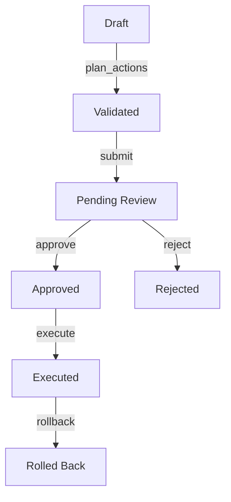

# ADR 0008: Approval Gate & ActionPlan Lifecycle

## Status
Accepted

## Context
AI agents modifying production BIM models (e.g., Revit, Navisworks) pose significant risks of silent data corruption, coordinate drift, or breaking company standards. We need a secure boundary where AI agents can propose changes (read, analyze, and plan) but can never execute modifying operations directly without explicit human review and approval. 

## Decisions

### 1. ActionPlan Lifecycle
An **ActionPlan** is the unit of human approval and execution control. It transitions through the following states:



- **Draft**: A plan containing proposed actions (tool calls and arguments) under construction.
- **Validated**: The plan has been checked against schemas, and dry-run validation checks have run (e.g., uniqueness, category support, element ownership).
- **Pending**: Submitted to the human approval queue, visible on the dockable panel.
- **Approved**: Human checked the parameter diffs and element counts, giving explicit consent.
- **Rejected**: Human rejected the plan; it is closed and archived.
- **Executed**: The changes are applied to the model inside host transactions.
- **Rolled Back**: The executed changes are reversed using Revit Undo (same session) or inverse parameters.

### 2. ActionPlan Schema
The ActionPlan represents a batch of modifications:
```json
{
  "plan_id": "plan_01J...ULID",
  "state": "pending",
  "created_at": "2026-07-08T18:07:30Z",
  "actions": [
    {
      "action_id": "act_01...",
      "tool": "revit.batch_set_parameters",
      "arguments": {
        "elements": ["revit-uniqueid-1"],
        "parameter": "FireRating",
        "value": "60"
      },
      "diff": {
        "type": "parameter_change",
        "before": {"revit-uniqueid-1": {"FireRating": null}},
        "after": {"revit-uniqueid-1": {"FireRating": "60"}},
        "element_count": 1
      }
    }
  ],
  "is_reversible": true,
  "reversible_strategy": "inverse"
}
```

### 3. The Approval Gate Middleware
- **Enforcement Location**: The unified Python MCP hub acts as the single choke point. 
- **Rule**: If `approval_mode=required` (default in panel mode), any tool call containing mutating or destructive metadata (`is_mutating=True` or `destructive=True`) must supply a valid, approved `plan_id`. Unplanned mutations are immediately blocked and returned as an authorization error.
- **Auto-Approval**: For headless CI/CD pipelines, `approval_mode=auto` can be set via environment variable (`MCP_REVIT_APPROVAL_MODE=auto`).

### 4. Rollback Strategies
- **Revit Undo (`undo`)**: If executed inside the same Revit session, the add-in wraps the execution in a single named transaction (`"AMB: Plan <plan_id>"`). The add-in can tigger Revit's native Undo command.
- **Inverse Counter-Plan (`inverse`)**: For persistent history rollbacks, the hub generates an inverse counter-plan by capturing the before-state (e.g., parameter values) and executing a compensating batch of updates.
- **Irreversible (`none`)**: High-risk operations (e.g., deleting models, file outputs) cannot be rolled back and require a double-confirmation from the human operator.

## Consequences
- **Trust & Safety**: Eliminates the risk of hallucinated or malicious AI writes damaging BIM models.
- **Audit Trails**: Every write corresponds to a versioned ActionPlan, a specific approving user, and an audit ledger entry.
- **Decoupled Orchestration**: AI agents can generate plans asynchronously while running long-running processes (e.g., clash detection), leaving the execution to the user.
