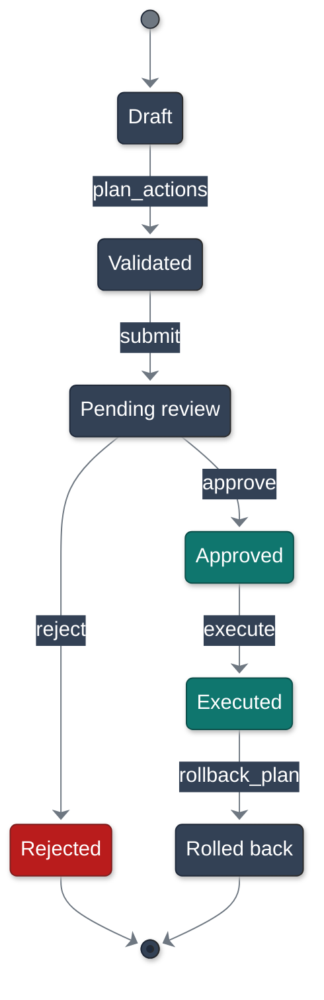

# ADR 0008: Approval Gate & ActionPlan Lifecycle

## Status
Accepted

## Context
AI agents modifying production BIM models (e.g., Revit, Navisworks) pose significant risks of silent data corruption, coordinate drift, or breaking company standards. We need a secure boundary where AI agents can propose changes (read, analyze, and plan) but can never execute modifying operations directly without explicit human review and approval. 

## Decisions

### 1. ActionPlan Lifecycle
An **ActionPlan** is the unit of human approval and execution control. It transitions through the following states:


```mermaid
---
config:
  look: neo
  theme: base
  themeVariables:
    primaryColor: "#334155"
    primaryTextColor: "#FFFFFF"
    primaryBorderColor: "#1E293B"
    secondaryColor: "#334155"
    tertiaryColor: "#334155"
    lineColor: "#6E7781"
    textColor: "#6E7781"
    titleColor: "#6E7781"
    nodeTextColor: "#FFFFFF"
    clusterBkg: "rgba(110,119,129,0.10)"
    clusterBorder: "#6E7781"
    edgeLabelBackground: "#334155"
    actorBkg: "#334155"
    actorTextColor: "#FFFFFF"
    actorBorder: "#1E293B"
    actorLineColor: "#6E7781"
    signalColor: "#6E7781"
    signalTextColor: "#6E7781"
    labelBoxBkgColor: "#334155"
    labelBoxBorderColor: "#6E7781"
    labelTextColor: "#FFFFFF"
    loopTextColor: "#6E7781"
    sequenceNumberColor: "#FFFFFF"
    noteBkgColor: "#F59E0B"
    noteTextColor: "#1F1300"
    noteBorderColor: "#92400E"
    transitionColor: "#6E7781"
    transitionLabelColor: "#FFFFFF"
    stateLabelColor: "#FFFFFF"
    stateBkg: "#334155"
    labelBackgroundColor: "#334155"
    compositeBackground: "#334155"
    specialStateColor: "#6E7781"
---
stateDiagram-v2
  state "Pending review" as Pending
  state "Rolled back" as RolledBack

  [*] --> Draft
  Draft --> Validated: plan_actions
  Validated --> Pending: submit
  Pending --> Approved: approve
  Pending --> Rejected: reject
  Approved --> Executed: execute
  Executed --> RolledBack: rollback_plan
  Rejected --> [*]
  RolledBack --> [*]

  classDef ok fill:#0F766E,stroke:#0B4F4A,color:#FFFFFF
  classDef blocked fill:#B91C1C,stroke:#7F1D1D,color:#FFFFFF
  class Approved,Executed ok
  class Rejected blocked
```

- **Draft**: A plan containing proposed actions (tool calls and arguments) under construction.
- **Validated**: The plan has been checked against schemas, and dry-run validation checks have run (e.g., uniqueness, category support, element ownership).
- **Pending**: Submitted to the human approval queue, visible on the dockable panel.
- **Approved**: Human checked the parameter diffs and element counts, giving explicit consent.
- **Rejected**: Human rejected the plan; it is closed and archived.
- **Executed**: The changes are applied to the model inside host transactions.
- **Rolled Back**: The recorded changes are reversed by `rollback_plan`, which applies inverse parameter values and can skip an action that has no recorded before-value. Revit's own Ctrl+Z is the other route. Neither is verified in a live Revit session (UNVERIFIED).

### 2. ActionPlan Schema
The ActionPlan represents a batch of modifications:
```json
{
  "plan_id": "plan_01J...ULID",
  "state": "pending",
  "created_at": "2026-07-08T18:07:30Z",
  "actions": [
    {
      "action_id": "act_01...",
      "tool": "revit.batch_set_parameters",
      "arguments": {
        "elements": ["revit-uniqueid-1"],
        "parameter": "FireRating",
        "value": "60"
      },
      "diff": {
        "type": "parameter_change",
        "before": {"revit-uniqueid-1": {"FireRating": null}},
        "after": {"revit-uniqueid-1": {"FireRating": "60"}},
        "element_count": 1
      }
    }
  ],
  "is_reversible": true,
  "reversible_strategy": "inverse"
}
```

### 3. The Approval Gate Middleware
- **Enforcement Location**: The unified Python MCP hub acts as the single choke point. 
- **Rule**: If `approval_mode=required` (default in panel mode), any tool call containing mutating or destructive metadata (`is_mutating=True` or `destructive=True`) must supply a valid, approved `plan_id`. Unplanned mutations are immediately blocked and returned as an authorization error.
- **Bound to the approved action** (approval v2): a call with a `plan_id` must match a not-yet-run action of that plan by tool name and canonical arguments (`plan_id`, `run_async`, `idempotency_key` are ignored; key order and `5` vs `5.0` do not matter). Only a `pending` plan can be approved; a `pending` or `approved` plan can be rejected, so a person can withdraw an approval before it runs.
- **Plan ids**: a `plan_id` must match `^plan_[0-9a-f]{12}$` and resolve to a file directly inside `<workspace>/plans` whose `plan_id` field matches. Anything else is refused.
- **Content binding**: `create_plan` stores `plan_hash` (SHA-256 over the plan id, creation time, snapshot, skipped list, and each action's id, tool, arguments and before value; plans that carry a `review` block, marked `hash_version: 2`, also cover the canonicalised review and `reverts_plan_id`). Approving requires `expected_hash`, the hash of the plan the person was shown (the command-line tool computes it from what it printed; the panel sends back the `plan_hash` from the list it rendered). `update_plan_state` refuses if the plan on disk does not have that hash, or no longer matches the hash stored at drafting, and stores `approved_hash`. Every execution path refuses an approved plan whose content no longer matches `approved_hash`.
- **Review block**: reviewable rationale (summary, reasoning, citations `{rule_id, clause, source}`, assumptions, excluded `{element_id, reason}`, warnings) goes in `review`, passed as `create_plan(review=...)` or the `plan_actions` `review` argument. It is strict (unknown keys refused, per-field length caps, 64 KB total), stored as given, hashed, and escaped by the command-line tool. Plans without a review keep hash version 1 and still verify; a plan mixing review and version is refused. Keys outside the hash (anything passed in `extra`, and lifecycle fields such as `state`, `approved_*`, `executed_at`, `results`) are metadata, not approved content, and `show` lists them. `plan_revert` writes conflicts, notes and warnings into `review`. The panel route sends a hub-validated `review_view` and the Plans view renders it; a v2 plan whose review cannot be shown has Approve disabled and points to `aec-model-bridge-approve show` (see docs/security.md, "Plan review in the panel").
- **At most once**: every execution path (MCP, `run_async` at queue time, panel, chat, recipe and module steps, `execute_plan`) calls `ApprovalGate.claim_action` before the tool runs. Under a per-plan lock (a thread lock plus a file lock), it checks the plan, finds the open action and creates `plans/.claims/<plan_id>.<action_id>` with `O_EXCL`, then marks the action `running`. When the tool returns, the action becomes `executed`; if it raises, it becomes `failed` and stays consumed. When no action is open or running, the plan becomes `executed` (all succeeded) or `partial`. A failed action needs a new plan.
- **Humans approve**: `approve_plan`, `reject_plan` and `rollback_plan` stay registered but are not listed to MCP clients and are refused by the shared dispatch (`security/dispatch.py`) used by MCP, the panel chat, module tool executors and the panel route, and by `ApprovalProvider.execute_tool` itself. A plan cannot contain them. They run only through `ApprovalProvider.execute_human_tool`, which the panel route calls with `via="panel"`, or through the command-line tool (`via="cli"`). The channel is set by the route; `approver`/`approved_via` arguments are ignored and `approved_by` is the OS account of the approving process.
- **`approval_mode`**: the value is trimmed and lower-cased; only `auto` disables the gate. Unknown values behave as `required` and log a warning.
- **Limits**: none of this authenticates the human. A process that can run shell commands as the user can run the command-line tool with `--yes`. The panel's `/execute` endpoint has no authentication; it relies on the Host/Origin/Content-Type checks from PR #93 and on a per-session token that is still pending. Software with write access to `<workspace>/plans` can replace a plan together with its stored hashes or remove claim files.
- **Pending only in the panel**: the panel's Plans list is fed by `ApprovalGate.list_pending_plans`, so it shows only plans in the `pending` state. `aec-model-bridge-approve show <plan_id>` works for plans in any state (`list` covers pending plans only). `proofs/<plan_id>.json` exists only for executed (or attempted) plans; approved-but-unexecuted and rejected plans have no proof bundle.
- **Auto-Approval**: For headless CI/CD pipelines, `approval_mode=auto` can be set via environment variable (`MCP_REVIT_APPROVAL_MODE=auto`).

### 4. Rollback Strategies
- **Revit Undo (`undo`)**: Design target, not built. The intent is one named transaction per plan (`"AMB: Plan <plan_id>"`), so that a single Ctrl+Z reverts the whole plan. Today the add-in names one transaction per action (for example one per parameter write), so undoing a plan takes one Ctrl+Z per action. A one-step undo for a whole plan is planned. Live-Revit behaviour is UNVERIFIED.
- **Inverse Counter-Plan (`inverse`)**: For persistent history rollbacks, the hub records the before-state (e.g., parameter values) and `rollback_plan` writes those values back in reverse order. An action with no recorded before-value (including an empty one) is skipped and reported as a warning, so a rollback can be partial. `plan_revert` drafts the same reversal as a new plan that needs approval. Live-Revit behaviour is UNVERIFIED.
- **Irreversible (`none`)**: High-risk operations (e.g., deleting models, file outputs) cannot be rolled back. A separate second confirmation for them is planned, not built: today they go through the same single approval as any other plan.

## Consequences
- **Trust & Safety**: Reduces the risk of hallucinated or malicious AI writes damaging BIM models. The gate is enforced in the hub; behaviour in a live Revit session is UNVERIFIED.
- **Audit Trails**: Every write corresponds to a versioned ActionPlan, a specific approving user, and an audit ledger entry.
- **Decoupled Orchestration**: AI agents can generate plans asynchronously while running long-running processes (e.g., clash detection), leaving the execution to the user.
