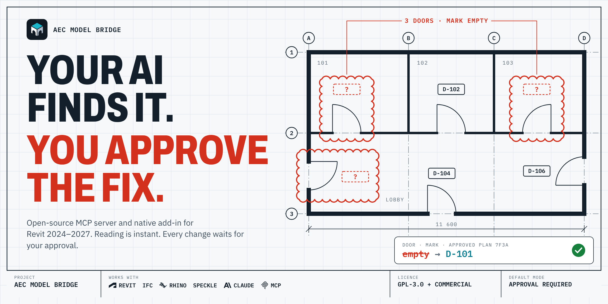
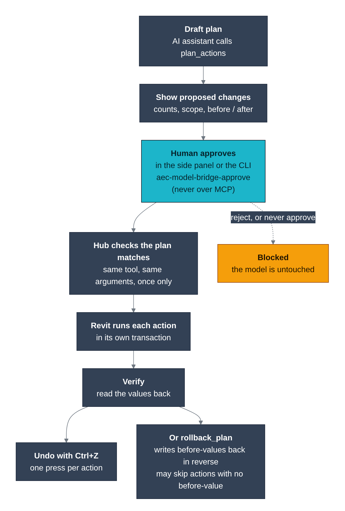

<div align="center">


[English](../../README.md) | [简体中文](README.zh-CN.md) | **Español** | [हिन्दी](README.hi.md) | [العربية](README.ar.md) | [Português (BR)](README.pt-BR.md) | [Русский](README.ru.md) | [日本語](README.ja.md) | [Deutsch](README.de.md) | [Français](README.fr.md) | [Bahasa Indonesia](README.id.md) | [Türkçe](README.tr.md) | [한국어](README.ko.md) | [Tiếng Việt](README.vi.md) | [Italiano](README.it.md) | [Polski](README.pl.md) | [繁體中文](README.zh-TW.md)

> Esta traducción se ha realizado con ayuda de IA. El [README](../../README.md) en inglés es la fuente de referencia; las correcciones son bienvenidas mediante pull request (consulta [CONTRIBUTING.md](../../CONTRIBUTING.md)).

**Pregunta a tu IA sobre el modelo de Revit que tienes abierto. De forma predeterminada, nada cambia hasta que lo apruebes.**

Servidor MCP de código abierto y complemento nativo para Revit 2024 – 2027. Funciona con Claude, Codex y otros clientes MCP.

[](https://github.com/Sam-AEC/aec-model-bridge/actions/workflows/ci.yml)
[](https://github.com/Sam-AEC/aec-model-bridge/releases/latest)
[](#versiones-de-revit-compatibles)
[](../../LICENSING.md)

[Primeros pasos](#inicio-rápido) | [Flujos de trabajo de ejemplo](#flujos-de-trabajo-de-ejemplo) | [Herramientas](../tools-generated.md) | [Documentación](#documentación) | [Descargar](https://github.com/Sam-AEC/aec-model-bridge/releases/latest)

</div>

<p align="center">
  
</p>

Conecta Claude, Codex u otro cliente MCP al modelo de Revit que tienes abierto.
AEC Model Bridge combina un servidor MCP en Python con un complemento nativo de Revit:
las herramientas de solo lectura inspeccionan el modelo al instante y, por defecto,
los cambios en el modelo exigen un plan aprobado. [Consulta el flujo de aprobación](#cómo-funciona-la-aprobación).

El mismo servidor incluye inspección de IFC, automatización de Rhino y Grasshopper
e integración con Speckle. El [estado de las integraciones](#otras-integraciones) distingue
los proveedores disponibles de los que están en desarrollo.

## Flujos de trabajo de ejemplo

Para coordinadores BIM: inspeccionar la calidad del modelo, revisar los elementos afectados,
aprobar una corrección de parámetros, comprobar los resultados y exportar un informe.
Estos ejemplos usan herramientas del [catálogo actual](../tools-generated.md).

| Flujo de trabajo | Solicitud de ejemplo | Herramientas utilizadas |
| --- | --- | --- |
| Revisión del modelo | "Muestra el documento activo, lista sus avisos y encuentra los elementos afectados." | `revit_get_document_info`, `revit_get_warnings`, `revit_get_elements_by_type` |
| Actualización de parámetros | "Busca los muros del Level 02, muestra los valores de Comments y propón una actualización por lotes." | `revit_get_elements_by_type`, `revit_get_element_parameters`, `revit_batch_set_parameters` |
| Producción de planos | "Prepara una lista de hojas a partir de este CSV y propón crear las hojas y colocar las vistas." | `revit_batch_create_sheets_from_csv`, `revit_place_viewport_on_sheet` |
| Revisión de IFC | "Muestra las plantas de este archivo IFC, inspecciona las propiedades de los muros e informa de los problemas de validación del esquema." | `ifc_get_spatial_structure`, `ifc_get_properties`, `ifc_validate` |

Para una primera prueba en Revit, prueba con:

```text
Read the active model's warnings. Group them by description and show the
affected element IDs. Then suggest which issues to investigate first.
```

Después prueba una corrección de parámetros, sustituyendo el nivel y el valor por los de tu proyecto:

```text
Find walls on Level 02 and show their current Comments values. Propose setting
Comments to "Coordination reviewed" for the elements I choose. After I approve
the plan in Revit, apply it and read the values back to confirm the result.
```

Para las ediciones, el asistente crea un plan con `plan_actions`; tú lo revisas en
el panel de Revit antes de que `execute_plan` lo aplique. La revisión de IFC funciona sin Revit.

Los módulos de QA/QC y de informes basados en instantáneas (snapshots) requieren una instantánea guardada compatible.
El traspaso actual de la instantánea de Revit al módulo exige que coincidan el nombre de archivo y el espacio de trabajo;
si omites `snapshot_id`, se pueden devolver datos de ejemplo generados. Usa las
herramientas directas de Revit indicadas arriba para la inspección en vivo. [Correcciones previstas y demo](../roadmap.md).

## Inicio rápido

**Instalación con un clic**

[](../install-buttons.md#vs-code)
[](https://cursor.com/en/install-mcp?name=aec-model-bridge&config=eyJjb21tYW5kIjoidXZ4IiwiYXJncyI6WyItLWZyb20iLCJnaXQraHR0cHM6Ly9naXRodWIuY29tL1NhbS1BRUMvYWVjLW1vZGVsLWJyaWRnZSNzdWJkaXJlY3Rvcnk9cGFja2FnZXMvbWNwLXNlcnZlci1yZXZpdCIsImFlYy1tb2RlbC1icmlkZ2UiXSwiZW52Ijp7Ik1DUF9SRVZJVF9NT0RFIjoiYnJpZGdlIn19)
[](https://github.com/Sam-AEC/aec-model-bridge/releases/latest)

Los botones solo necesitan [uv](https://docs.astral.sh/uv/getting-started/installation/)
y ninguna otra configuración: el servidor usa `~/Documents/AEC Model Bridge` como
espacio de trabajo salvo que definas el tuyo. Para Claude Desktop, descarga el archivo `.mcpb`
de la última versión y ábrelo. Trabajar con Revit en vivo sigue requiriendo Revit y
[el complemento](#instalar-el-complemento-de-revit); el modo mock no necesita nada.

**Configuración manual**

Para la automatización de Revit en vivo necesitas Windows, una licencia de Revit 2024 a 2027,
Python 3.11 o superior, [uv](https://docs.astral.sh/uv/getting-started/installation/) y el complemento de Revit
([pasos de instalación](#instalar-el-complemento-de-revit)). Después añade esto a tu
`claude_desktop_config.json` (Codex, Cursor y VS Code usan los mismos valores;
las dos variables de directorio son opcionales y por defecto apuntan al espacio de trabajo indicado arriba):

```json
{
  "mcpServers": {
    "aec-model-bridge": {
      "command": "uvx",
      "args": [
        "--from",
        "git+https://github.com/Sam-AEC/aec-model-bridge#subdirectory=packages/mcp-server-revit",
        "aec-model-bridge"
      ],
      "env": {
        "MCP_REVIT_MODE": "bridge",
        "MCP_REVIT_WORKSPACE_DIR": "C:\\RevitProjects",
        "MCP_REVIT_ALLOWED_DIRECTORIES": "C:\\RevitProjects"
      }
    }
  }
}
```

¿Quieres ver primero las herramientas, sin Revit? Define `"MCP_REVIT_MODE": "mock"`.
El servidor arranca en cualquier equipo, lista todas las herramientas con su esquema y devuelve
respuestas predefinidas sin tocar ningún modelo. En la raíz del repositorio hay un `Dockerfile` para el mismo
modo mock (`docker build -t aec-model-bridge .` y después
`docker run -i --rm aec-model-bridge`).

¿Usas VS Code? El [código de la extensión y los pasos de instalación local](../../extensions/vscode/README.md)
registran el servidor MCP y muestran el estado de la conexión con Revit. Aún no se ha
publicado en el Marketplace.

### Herramientas de un vistazo

| Área | Herramientas | Qué hacen |
| --- | --- | --- |
| Revit | 103 | Leer el modelo, crear y editar elementos, parámetros, vistas, hojas, tablas de planificación, exportaciones, trabajo compartido |
| Aprobación | 6 | Planificar, revisar, aprobar, ejecutar y revertir cambios en el modelo |
| Módulos | 34 | Inspección de instantáneas, cuadrículas de parámetros, comprobaciones de QA/QC, recetas, informes, selecciones |
| Rhino y Grasshopper | 19 | Geometría, capas, materiales, operaciones booleanas |
| Speckle | 17 | Proyectos, modelos, versiones, envío y recepción |
| Navisworks | 15 | Árbol del modelo, puntos de vista, pruebas de interferencias (en desarrollo) |
| IFC | 7 | Leer archivos IFC sin Revit: estructura, propiedades, validación |
| Grafo, instantáneas, exportaciones, tareas | 18 | Auditorías del grafo semántico, diferencias entre instantáneas, exportación a SQLite, tareas en segundo plano |

En la configuración predeterminada aparecen 219 herramientas (contadas desde el servidor actual en modo
mock). Las herramientas de Autodesk Data aparecen cuando se configuran credenciales de APS. La
[referencia de herramientas](../tools-generated.md) las enumera todas. Cada herramienta incluye
anotaciones MCP (`readOnlyHint`, `destructiveHint`, `idempotentHint`,
`openWorldHint`), de modo que los clientes distinguen las lecturas de las escrituras.

### Automatización avanzada de Revit

Además de las consultas al modelo y las actualizaciones de parámetros, las herramientas de Revit crean elementos de construcción,
vistas, hojas, tablas de planificación, etiquetas y cotas, y exportan archivos IFC, DWG,
imágenes y Navisworks. Consulta la [referencia de herramientas](../tools-generated.md)
para ver las operaciones y entradas admitidas.

Para lo que el catálogo de herramientas no cubre, `revit_invoke_method`, `revit_reflect_get`
y `revit_reflect_set` trabajan con miembros públicos de la API de Revit, y `revit_execute_python`
ejecuta IronPython dentro de Revit. Estas herramientas avanzadas tienen los mismos permisos que
el proceso de Revit. Úsalas solo con clientes MCP y prompts de confianza.

## Cómo funciona

El cliente MCP habla con un único hub de Python. El hub envía cada llamada al
proveedor que posee la herramienta. Los proveedores de aplicaciones de escritorio hablan con un pequeño complemento
dentro de esa aplicación a través de localhost.

<p align="center">
  <picture>
    <source media="(prefers-color-scheme: dark)" srcset="../images/architecture-dark.png">
    
  </picture>
</p>

<sub>Origen del diagrama: [architecture.mmd](../diagrams/architecture.mmd). Regenera las imágenes con `python scripts/render_diagrams.py`.</sub>

Los recuadros verde azulado funcionan hoy. Los recuadros ámbar con línea discontinua están en desarrollo. Las
formas índigo son datos y servicios externos.

### Cómo funciona la aprobación

El hub bloquea cualquier llamada a una herramienta que modifique el modelo salvo que lleve un
plan aprobado. El modo predeterminado es `required`. La IA propone un plan, tú
lo revisas en el panel lateral de Revit y el complemento lo ejecuta en el hilo principal de Revit
con una transacción con nombre.

<p align="center">
  <picture>
    <source media="(prefers-color-scheme: dark)" srcset="https://raw.githubusercontent.com/Sam-AEC/aec-model-bridge/main/docs/images/readme/readme-workflow-dark.png">
    
  </picture>
</p>

<p align="center">
  <picture>
    <source media="(prefers-color-scheme: dark)" srcset="../images/approval-flow-dark.png">
    
  </picture>
</p>

<sub>Origen del diagrama: [approval-flow.mmd](../diagrams/approval-flow.mmd). Regenera las imágenes con `python scripts/render_diagrams.py`.</sub>

Si un plan se aprueba y después resulta ser erróneo, `rollback_plan` lo revierte.
La reversión usa Deshacer de Revit en la misma sesión o los valores de parámetros inversos.
Las operaciones que no se pueden revertir, como la salida a archivos, piden una segunda
confirmación. El ciclo de vida está descrito en
[ADR 0008](../0008-approval-gate-lifecycle.md).

Para pipelines desatendidos puedes definir `MCP_REVIT_APPROVAL_MODE=auto`. Eso desactiva
la comprobación humana, así que úsalo solo en un entorno controlado.

## Versiones de Revit compatibles

| Versión de Revit | Destino del complemento | Herramientas de compilación |
|---|---|---|
| 2024 | .NET Framework 4.8 | .NET 8 SDK y .NET Framework 4.8 developer pack |
| 2025 | .NET 8 for Windows | .NET 8 SDK |
| 2026 | .NET 8 for Windows | .NET 8 SDK |
| 2027 | .NET 10 for Windows | .NET 10 SDK |

También necesitas Windows 10 u 11, Python 3.11 o posterior y una instalación de Revit con licencia
para la versión que uses. El modo mock ejecuta el servidor sin Revit,
lo que resulta útil para desarrollo y pruebas.

### Otras integraciones

| Integración | Estado |
|---|---|
| Revit | Disponible. Complemento nativo en C#. |
| IFC (IfcOpenShell) | Disponible. Lee archivos IFC sin necesidad de tener Revit en ejecución. |
| Rhino y Grasshopper | Disponible. Se conecta al complemento de Rhino en `localhost:3004`. |
| Speckle | Disponible. Requiere un ID de cliente de Speckle en tu entorno. |
| Navisworks Manage | En desarrollo. El proveedor y sus herramientas están registrados. El complemento de Navisworks no está terminado. |
| Power BI | En desarrollo. El proveedor y la herramienta existen, pero no están registrados en el hub. |
| Excel, Parquet y DuckDB | Previsto. |

## Instalar el complemento de Revit

**La forma más sencilla (Windows):** descarga `AECModelBridge-Setup-<version>.exe` de la [última versión](https://github.com/Sam-AEC/aec-model-bridge/releases/latest), haz doble clic, elige tus versiones de Revit y reinicia Revit. Instala el complemento, el servidor de Python incluido y, si marcas la casilla, la configuración de Claude Desktop y VS Code, con una copia de seguridad de tu configuración actual. Se desinstala desde la Configuración de Windows. Los pasos siguientes son para compilar desde el código fuente.

Instalas dos partes: el servidor MCP de Python y el complemento de Revit. La automatización
de Revit en vivo necesita ambas.

### 1. Instalar el servidor MCP

```powershell
git clone https://github.com/Sam-AEC/aec-model-bridge.git
cd aec-model-bridge

py -m venv .venv
.\.venv\Scripts\Activate.ps1
python -m pip install -e packages/mcp-server-revit
```

### 2. Instalar el complemento de Revit

Ajusta la versión para que coincida con tu instalación de Revit. Si Windows bloquea los
scripts descargados, haz clic con el botón derecho en cada archivo `.ps1`, abre Propiedades y selecciona
Desbloquear antes de ejecutarlos.

```powershell
$RevitVersion = Read-Host "Revit year (2024, 2025, 2026, or 2027)"

.\scripts\package.ps1 -RevitVersion $RevitVersion
.\scripts\install.ps1 -RevitVersion $RevitVersion
```

El instalador coloca los binarios específicos de cada versión en:

```text
C:\ProgramData\AECModelBridge\bin\<year>
```

El manifiesto del complemento se instala por usuario en:

```text
%APPDATA%\Autodesk\Revit\Addins\<year>
```

Usa `-AllUsers` con `install.ps1` para instalar el manifiesto en
`C:\ProgramData\Autodesk\Revit\Addins\<year>`.

Para preparar los binarios de todas las versiones compatibles de una sola vez:

```powershell
.\scripts\package.ps1 -RevitVersion All
```

Cada [versión de GitHub](https://github.com/Sam-AEC/aec-model-bridge/releases/latest)
incluye un paquete ya preparado por cada año de Revit, por ejemplo
`aec-model-bridge-revit-2026-<version>.zip`. Descomprímelo y ejecuta
`.\install.ps1 -RevitVersion 2026` en lugar de compilar desde el código fuente. Para un instalador
de Windows de doble clic, `scripts/build-installer.ps1` genera uno con Inno Setup.
La guía completa, con la resolución de problemas, está en [docs/install.md](../install.md).

## Conectar Claude Desktop con Revit

Añade el servidor a la configuración de tu cliente MCP. En Claude Desktop, es
la sección `mcpServers` de `claude_desktop_config.json`. Codex, Cursor, VS
Code y otros clientes MCP usan los mismos valores de `command`, `args` y `env` en
su propio formato de configuración.

Usa el ejecutable de Python de tu entorno virtual y elige una carpeta de espacio de trabajo
a la que el servidor pueda acceder:

```json
{
  "mcpServers": {
    "aec-model-bridge": {
      "command": "C:\\path\\to\\aec-model-bridge\\.venv\\Scripts\\python.exe",
      "args": ["-m", "revit_mcp_server.mcp_server"],
      "env": {
        "MCP_REVIT_MODE": "bridge",
        "MCP_REVIT_WORKSPACE_DIR": "C:\\RevitProjects",
        "MCP_REVIT_ALLOWED_DIRECTORIES": "C:\\RevitProjects"
      }
    },
    "aec-model-bridge-revit-2026": {
      "command": "C:\\path\\to\\aec-model-bridge\\.venv\\Scripts\\python.exe",
      "args": ["-m", "revit_mcp_server.mcp_server"],
      "env": {
        "MCP_REVIT_MODE": "bridge",
        "MCP_REVIT_HOST_VERSION": "2026",
        "MCP_REVIT_WORKSPACE_DIR": "C:\\RevitProjects",
        "MCP_REVIT_ALLOWED_DIRECTORIES": "C:\\RevitProjects"
      }
    }
  }
}
```

Omite `MCP_REVIT_HOST_VERSION` para apuntar a la instancia de Revit abierta más reciente.
Defínelo con un año como `2024` o `2026` para fijar una entrada de cliente a esa
versión de Revit. `MCP_REVIT_BRIDGE_URL` sustituye el endpoint en configuraciones avanzadas.

Los usuarios de VS Code pueden partir de [`.vscode/mcp.json`](../../.vscode/mcp.json). Los usuarios de Hermes
Desktop pueden partir de [`docs/examples/hermes-desktop.json`](../examples/hermes-desktop.json) tras sustituir la
ruta de Python de ejemplo. Los clientes compatibles con MCP Bundles pueden instalar el
archivo `.mcpb` de la
[última versión](https://github.com/Sam-AEC/aec-model-bridge/releases/latest).
El complemento de Revit sigue siendo necesario, porque el servidor se comunica con la
aplicación de escritorio en ejecución.

### Comprobar la conexión

Reinicia Revit después de instalar el complemento, abre un modelo y ejecuta:

```powershell
$registry = Get-ChildItem "$env:LOCALAPPDATA\AECModelBridge\registry\revit-*.json" | Select-Object -First 1
$switch = Get-Content $registry.FullName -Raw | ConvertFrom-Json
Invoke-RestMethod "$($switch.endpoint)/health"
```

La respuesta debe indicar `healthy` y la versión de Revit en ejecución. En Revit,
busca la pestaña de la cinta `AEC Bridge`. Su panel Workflows incluye Open Panel,
Health Check, Pending Actions y Reports. Su panel Tools incluye Config, Help
y About.

## Seguridad

- El puente de Revit escucha solo en localhost.
- El servidor lee y escribe únicamente dentro de las carpetas de `MCP_REVIT_ALLOWED_DIRECTORIES`.
- Las herramientas que modifican el modelo necesitan un plan aprobado, salvo que desactives la aprobación.
- Las llamadas a herramientas se registran en un log de auditoría y los secretos se ocultan.

Los detalles están en [docs/security.md](../security.md). Para notificar una
vulnerabilidad, sigue [SECURITY.md](../../SECURITY.md).

## Preguntas frecuentes

### ¿Qué es un servidor MCP para Revit?

El Model Context Protocol (MCP) es un estándar abierto que permite a los asistentes de IA
llamar a herramientas de otro software. Un servidor MCP para Revit publica operaciones de Revit
como herramientas. El asistente elige las herramientas y el complemento las ejecuta
dentro de Revit.

### ¿Con qué asistentes de IA funciona?

Con cualquier cliente MCP capaz de iniciar un servidor stdio local. Documentamos Claude
Desktop, VS Code con GitHub Copilot y los clientes que leen una configuración estándar de
`mcpServers`. El chat del panel también puede usar una clave de API de Anthropic
o las herramientas de línea de comandos `claude` o `codex`, si están instaladas. Consulta
[ADR 0012](../0012-native-agent-chat-backend.md).

### ¿Puede la IA cambiar mi modelo sin preguntar?

No en el modo predeterminado. Las herramientas que modifican el modelo quedan bloqueadas hasta que se aprueba un plan
en el panel de Revit. Las herramientas de solo lectura se ejecutan sin aprobación. Si
defines `MCP_REVIT_APPROVAL_MODE=auto`, se omite la aprobación.

### ¿Envía mi modelo a la nube?

El servidor y el complemento se ejecutan en tu equipo, y el puente escucha en
localhost. Lo que ve el asistente de IA depende del cliente que uses: los resultados
de las herramientas van al proveedor del modelo de ese cliente. Los proveedores conectados a la nube, como
Speckle, solo se ejecutan cuando los configuras y llamas a sus herramientas.

### ¿Funciona con archivos IFC sin Revit?

Sí. El proveedor de IFC lee los archivos con IfcOpenShell. Puede devolver los metadatos
del archivo, la estructura espacial, las propiedades de los elementos y los cuadros delimitadores, ejecutar
consultas por clase, GUID, nombre o propiedad, y validar el esquema. No
edita archivos IFC.

### ¿Puedo usarlo sin tener Revit instalado?

Puedes ejecutar el servidor en modo mock para desarrollo y pruebas. El trabajo en vivo con el modelo
necesita Revit 2024 a 2027 y el complemento.

## Versiones y publicaciones

AEC Model Bridge sigue el versionado semántico. Las versiones se etiquetan como `vX.Y.Z` en
GitHub y un archivo `VERSION` en la raíz contiene el número de versión. Consulta
[docs/versioning.md](../versioning.md) para el proceso de publicación y
[CHANGELOG.md](../../CHANGELOG.md) para los cambios de cada versión.

## Desarrollo

```powershell
# Python tests
python -m pytest packages/mcp-server-revit/tests

# Build one Revit version, for example 2026
.\scripts\build-addin.ps1 -RevitVersion 2026 -Configuration Release

# Build all supported versions
.\scripts\package.ps1 -RevitVersion All
```

La CI compila el servidor de Python y los destinos del complemento para Revit 2024 a 2027.
Consulta [CONTRIBUTING.md](../../CONTRIBUTING.md) antes de abrir un pull request.

## Documentación

- [Guía de instalación](../install.md)
- [Referencia de herramientas](../tools-generated.md)
- [Arquitectura](../0001-multi-provider-architecture.md)
- [Referencia de configuración](../configuration-reference.md)
- [Seguridad](../security.md)
- [Clientes MCP y registro](../marketplaces.md)
- [Versionado y publicaciones](../versioning.md)
- [Toda la documentación](../README.md)
- [Guía de contribución](../../CONTRIBUTING.md) y [Código de conducta](../../CODE_OF_CONDUCT.md)
- [Colaboradores](../../CONTRIBUTORS.md)

## Proyecto y licencia

Mantenido por [A. Sam Mohammad](https://github.com/Sam-AEC).
[LinkedIn](https://www.linkedin.com/in/a-sam-mohammad-92790416b) |
[Issues](https://github.com/Sam-AEC/aec-model-bridge/issues)

[GPL-3.0-or-later con la Revit Linking Exception, o una licencia comercial](../../LICENSING.md).
