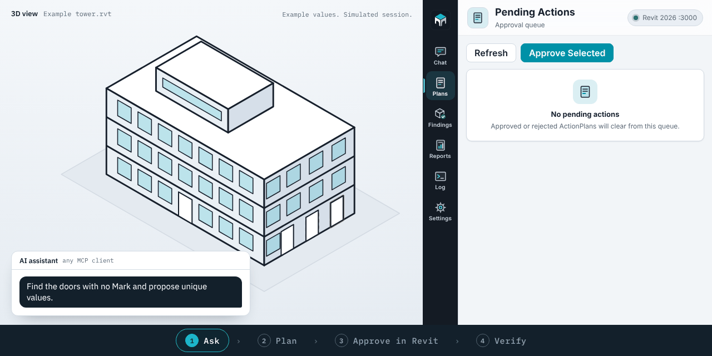
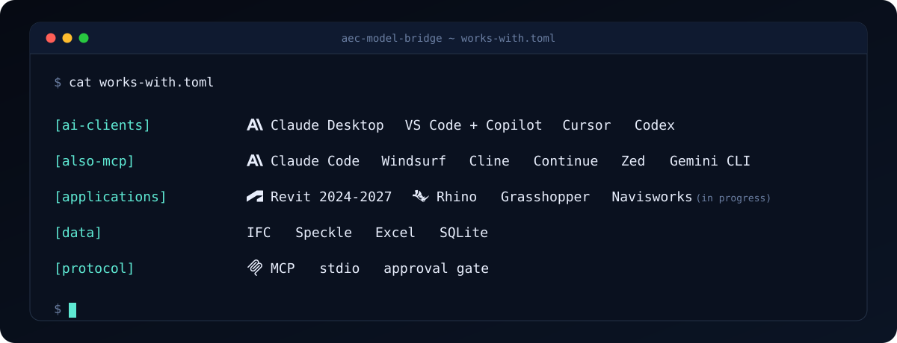
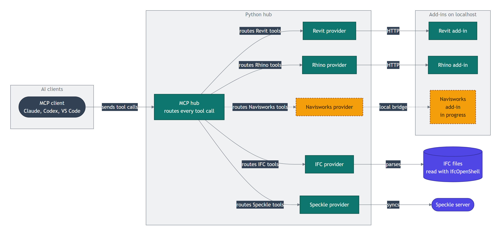

<div align="center">


[English](../../README.md) | [简体中文](README.zh-CN.md) | [Español](README.es.md) | [हिन्दी](README.hi.md) | [العربية](README.ar.md) | [Português (BR)](README.pt-BR.md) | [Русский](README.ru.md) | [日本語](README.ja.md) | [Deutsch](README.de.md) | [Français](README.fr.md) | [Bahasa Indonesia](README.id.md) | **Türkçe** | [한국어](README.ko.md) | [Tiếng Việt](README.vi.md) | [Italiano](README.it.md) | [Polski](README.pl.md) | [繁體中文](README.zh-TW.md)

> Bu çeviri yapay zekâ desteğiyle hazırlanmıştır. Esas kaynak İngilizce [README](../../README.md) dosyasıdır; düzeltmeler için pull request göndermekten çekinmeyin (bkz. [CONTRIBUTING.md](../../CONTRIBUTING.md)).

**Açık Revit modelinizi yapay zekâya sorun. Varsayılan olarak siz bir planı onaylayana kadar yazma araçları engellenir.**

Revit 2024 – 2027 için açık kaynaklı MCP sunucusu ve yerel eklenti. Claude, Codex ve diğer MCP istemcileriyle çalışır.

[](https://github.com/Sam-AEC/aec-model-bridge/actions/workflows/ci.yml)
[](https://github.com/Sam-AEC/aec-model-bridge/releases/latest)
[](#desteklenen-revit-sürümleri)
[](../../LICENSING.md)

[Başlangıç](#hızlı-başlangıç) | [Örnek iş akışları](#örnek-iş-akışları) | [Araçlar](../tools-generated.md) | [Dokümantasyon](#dokümantasyon) | [İndir](https://github.com/Sam-AEC/aec-model-bridge/releases/latest)

</div>

<p align="center">
  
</p>

AEC Model Bridge, Claude, Codex, Cursor ve diğer yapay zekâ asistanlarının açık Revit modelinizi okumasını ve düzenlemesini sağlayan açık kaynaklı Revit MCP sunucusudur; her değişikliği önce siz onaylarsınız. Python tabanlı bir MCP sunucusunu yerel bir Revit eklentisiyle birleştirir: salt okunur araçlar modeli hemen inceler, model değişiklikleri ise varsayılan olarak onaylanmış bir plan gerektirir. [Onay akışına bakın](#onay-nasıl-çalışır).

<p align="center">
  
</p>

Kurulum Claude Desktop, GitHub Copilot'lı VS Code, Cursor ve Codex için belgelenmiştir. Standart bir MCP stdio sunucusu olduğundan Claude Code, Windsurf, Cline, Continue, Zed ve Gemini CLI gibi diğer istemciler de çalışmalıdır. Nelerin belgelendiğini ve nelerin test edilmediğini [uyumluluk](../compatibility.md) sayfasında bulabilirsiniz.

Aynı sunucu IFC incelemesini, Rhino ve Grasshopper otomasyonunu ve Speckle entegrasyonunu da içerir. [Entegrasyon durumu](#diğer-entegrasyonlar), hazır sağlayıcıları üzerinde çalışılanlardan ayırır.

## Örnek iş akışları

BIM koordinatörleri için: model kalitesini inceleyin, etkilenen elemanları gözden geçirin, bir parametre düzeltmesini onaylayın, ardından sonuçları kontrol edip rapor dışa aktarın. Bu örnekler [güncel katalogdaki](../tools-generated.md) araçları kullanır.

| İş akışı | Örnek istek | Kullanılan araçlar |
| --- | --- | --- |
| Model incelemesi | "Aktif belgeyi göster, uyarılarını listele ve etkilenen elemanları bul." | `revit_get_document_info`, `revit_get_warnings`, `revit_get_elements_by_type` |
| Parametre güncellemeleri | "Level 02'deki duvarları bul, Comments değerlerini göster ve toplu bir güncelleme öner." | `revit_get_elements_by_type`, `revit_get_element_parameters`, `revit_batch_set_parameters` |
| Çizim üretimi | "Bu CSV'den bir pafta (sheet) listesi hazırla, ardından paftaları oluşturmayı ve görünümleri yerleştirmeyi öner." | `revit_batch_create_sheets_from_csv`, `revit_place_viewport_on_sheet` |
| IFC incelemesi | "Bu IFC dosyasının katlarını göster, duvar özelliklerini incele ve şema doğrulama sorunlarını raporla." | `ifc_get_spatial_structure`, `ifc_get_properties`, `ifc_validate` |

Revit'te ilk denemeniz için şunu yazın:

```text
Read the active model's warnings. Group them by description and show the
affected element IDs. Then suggest which issues to investigate first.
```

Ardından bir parametre düzeltmesi deneyin; seviyeyi ve değeri projenize göre değiştirin:

```text
Find walls on Level 02 and show their current Comments values. Propose setting
Comments to "Coordination reviewed" for the elements I choose. After I approve
the plan in Revit, apply it and read the values back to confirm the result.
```

Düzenlemeler için asistan `plan_actions` ile bir plan oluşturur; `execute_plan` uygulamadan önce planı Revit panelinde incelersiniz. IFC incelemesi Revit olmadan çalışır.

Snapshot tabanlı QA/QC ve rapor modülleri, uyumlu ve kaydedilmiş bir snapshot gerektirir. Revit'ten modüle snapshot aktarımı şu anda dosya adı ve çalışma alanının uyumlu olmasını gerektirir; `snapshot_id` verilmezse üretilmiş örnek veri dönebilir. Canlı inceleme için yukarıdaki doğrudan Revit araçlarını kullanın. [Planlanan düzeltmeler ve demo](../roadmap.md).

## Hızlı başlangıç

**Tek tıkla kurulum**

[](../install-buttons.md#vs-code)
[](https://cursor.com/en/install-mcp?name=aec-model-bridge&config=eyJjb21tYW5kIjoidXZ4IiwiYXJncyI6WyItLWZyb20iLCJnaXQraHR0cHM6Ly9naXRodWIuY29tL1NhbS1BRUMvYWVjLW1vZGVsLWJyaWRnZSNzdWJkaXJlY3Rvcnk9cGFja2FnZXMvbWNwLXNlcnZlci1yZXZpdCIsImFlYy1tb2RlbC1icmlkZ2UiXSwiZW52Ijp7Ik1DUF9SRVZJVF9NT0RFIjoiYnJpZGdlIn19)
[](https://github.com/Sam-AEC/aec-model-bridge/releases/latest)

Düğmeler yalnızca [uv](https://docs.astral.sh/uv/getting-started/installation/) gerektirir, başka bir kurulum gerekmez: kendi çalışma alanınızı belirlemediğiniz sürece sunucu `~/Documents/AEC Model Bridge` klasörünü çalışma alanı olarak kullanır. Claude Desktop için en son yayından `.mcpb` dosyasını indirip açın. Canlı Revit çalışması için yine Revit ve [eklenti](#revit-eklentisini-kurma) gerekir; mock modu hiçbir şey gerektirmez.

**Elle kurulum**

Canlı Revit otomasyonu için Windows, lisanslı Revit 2024–2027, Python 3.11 veya üzeri, [uv](https://docs.astral.sh/uv/getting-started/installation/) ve Revit eklentisi gerekir ([kurulum adımları](#revit-eklentisini-kurma)). Ardından bunu `claude_desktop_config.json` dosyanıza ekleyin (Codex, Cursor ve VS Code aynı değerleri kullanır; iki dizin değişkeni isteğe bağlıdır ve varsayılan olarak yukarıdaki çalışma alanını kullanır):

```json
{
  "mcpServers": {
    "aec-model-bridge": {
      "command": "uvx",
      "args": [
        "--from",
        "git+https://github.com/Sam-AEC/aec-model-bridge#subdirectory=packages/mcp-server-revit",
        "aec-model-bridge"
      ],
      "env": {
        "MCP_REVIT_MODE": "bridge",
        "MCP_REVIT_WORKSPACE_DIR": "C:\\RevitProjects",
        "MCP_REVIT_ALLOWED_DIRECTORIES": "C:\\RevitProjects"
      }
    }
  }
}
```

Önce araçlara Revit olmadan göz atmak mı istiyorsunuz? `"MCP_REVIT_MODE": "mock"` ayarlayın. Sunucu her yerde başlar, tüm araçları şemalarıyla listeler ve bir modele dokunmadan hazır yanıtlar döndürür. Aynı mock modu için bir `Dockerfile` deponun kök dizinindedir (`docker build -t aec-model-bridge .`, ardından `docker run -i --rm aec-model-bridge`).

VS Code mu kullanıyorsunuz? [Eklenti kaynağı ve yerel kurulum adımları](../../extensions/vscode/README.md) MCP sunucusunu kaydeder ve Revit bağlantı durumunu gösterir. Marketplace'te yayımlanmamıştır.

### Araçlara genel bakış

| Alan | Araçlar | Ne yaparlar |
| --- | --- | --- |
| Revit | 103 | Modeli okuma; eleman, parametre, görünüm, pafta, çizelge oluşturma ve düzenleme; dışa aktarma; çalışma paylaşımı (worksharing) |
| Onay | 6 | Model değişikliklerini planlama, inceleme, onaylama, çalıştırma ve geri alma |
| Modüller | 34 | Snapshot incelemesi, parametre ızgaraları, QA/QC kontrolleri, reçeteler, raporlar, seçimler |
| Rhino ve Grasshopper | 19 | Geometri, katmanlar, malzemeler, boolean işlemleri |
| Speckle | 17 | Projeler, modeller, sürümler, gönderme ve alma |
| Navisworks | 15 | Model ağacı, bakış noktaları, çakışma testleri (geliştirme sürüyor) |
| IFC | 7 | IFC dosyalarını Revit olmadan okuma: yapı, özellikler, doğrulama |
| Grafik, snapshot'lar, dışa aktarmalar, işler | 18 | Anlamsal grafik denetimleri, snapshot farkları, SQLite dışa aktarma, arka plan işleri |

Varsayılan kurulumda 219 araç listelenir (mock modundaki mevcut sunucudan sayılmıştır). Autodesk Data araçları, APS kimlik bilgileri yapılandırıldığında görünür. [Araç başvurusu](../tools-generated.md) tüm araçları listeler. Her araç, istemcilerin okuma ile yazmayı ayırt edebilmesi için MCP ek açıklamaları (annotations; `readOnlyHint`, `destructiveHint`, `idempotentHint`, `openWorldHint`) taşır.

### Gelişmiş Revit otomasyonu

Model sorguları ve parametre güncellemelerinin yanı sıra Revit araçları yapı elemanları, görünümler, paftalar, çizelgeler, etiketler ve ölçüler oluşturur; IFC, DWG, görüntü ve Navisworks dosyaları dışa aktarır. Desteklenen işlemler ve girdiler için [araç başvurusuna](../tools-generated.md) bakın.

Araç kataloğunun kapsamadığı durumlar için `revit_invoke_method`, `revit_reflect_get` ve `revit_reflect_set` genel Revit API üyeleriyle çalışır, `revit_execute_python` ise Revit içinde IronPython çalıştırır. Bu gelişmiş araçlar Revit işlemiyle aynı izinlere sahiptir. Yalnızca güvendiğiniz MCP istemcileri ve prompt'larla kullanın.

## Nasıl çalışır

MCP istemcisi tek bir Python hub'ıyla konuşur. Hub her çağrıyı o araca sahip sağlayıcıya iletir. Masaüstü uygulamaları için sağlayıcılar, o uygulamanın içindeki küçük bir eklentiyle localhost üzerinden konuşur.

<p align="center">
  <picture>
    <source media="(prefers-color-scheme: dark)" srcset="../images/architecture-dark.png">
    
  </picture>
</p>

<sub>Diyagram kaynağı: [architecture.mmd](../diagrams/architecture.mmd). Görselleri `python scripts/render_diagrams.py` ile yeniden oluşturun.</sub>

Turkuaz kutular bugün çalışıyor. Kehribar rengi kesikli kutuların üzerinde çalışılıyor. İndigo şekiller veri ve harici hizmetlerdir.

### Onay nasıl çalışır

Hub, onaylanmış bir plan taşımayan ve modeli değiştiren her araç çağrısını durdurur. Varsayılan mod `required`'dır. Yapay zekâ bir plan önerir, siz Revit yan panelinde incelersiniz ve eklenti planı Revit'in ana iş parçacığında adlandırılmış bir transaction içinde çalıştırır.

<p align="center">
  <picture>
    <source media="(prefers-color-scheme: dark)" srcset="https://raw.githubusercontent.com/Sam-AEC/aec-model-bridge/main/docs/images/readme/readme-workflow-dark.png">
    
  </picture>
</p>

<p align="center">
  <picture>
    <source media="(prefers-color-scheme: dark)" srcset="../images/approval-flow-dark.png">
    
  </picture>
</p>

<sub>Diyagram kaynağı: [approval-flow.mmd](../diagrams/approval-flow.mmd). Görselleri `python scripts/render_diagrams.py` ile yeniden oluşturun.</sub>

Bir plan hatalı çıkarsa Revit'te Ctrl+Z ile geri alın. Her parametre yazımı kendi adlandırılmış işlemidir, bu yüzden tek bir plan için birkaç kez basmanız gerekebilir. Tüm plan için tek adımda geri alma planlanmıştır, henüz yapılmamıştır. `rollback_plan` kaydedilen önceki değerleri ters sırayla geri yazar ve önceki değer kaydedilmemişse bir eylemi atlayabilir; bu yüzden uyarılarını okuyun. İki yol da henüz gerçek bir Revit oturumunda doğrulanmadı (UNVERIFIED). Dosya çıktısı gibi geri alınamayan işlemler ikinci bir onay ister. Yaşam döngüsü [ADR 0008](../0008-approval-gate-lifecycle.md) belgesindedir.

Gözetimsiz pipeline'lar için `MCP_REVIT_APPROVAL_MODE=auto` ayarlayabilirsiniz. Bu, insan denetimini kapatır; bu yüzden yalnızca kontrollü bir ortamda kullanın.

## Desteklenen Revit sürümleri

| Revit sürümü | Eklenti hedefi | Derleme araçları |
|---|---|---|
| 2024 | .NET Framework 4.8 | .NET 8 SDK ve .NET Framework 4.8 developer pack |
| 2025 | .NET 8 for Windows | .NET 8 SDK |
| 2026 | .NET 8 for Windows | .NET 8 SDK |
| 2027 | .NET 10 for Windows | .NET 10 SDK |

Ayrıca Windows 10 veya 11, Python 3.11 veya üzeri ve kullandığınız sürüm için lisanslı bir Revit kurulumu gerekir. Mock modu sunucuyu Revit olmadan çalıştırır; bu, geliştirme ve testler için kullanışlıdır.

### Diğer entegrasyonlar

| Entegrasyon | Durum |
|---|---|
| Revit | Kullanılabilir. Yerel C# eklentisi. |
| IFC (IfcOpenShell) | Kullanılabilir. Revit çalışmadan IFC dosyalarını okur. |
| Rhino ve Grasshopper | Kullanılabilir. `localhost:3004` üzerindeki Rhino eklentisine bağlanır. |
| Speckle | Kullanılabilir. Ortamınızda bir Speckle istemci kimliği gerekir. |
| Navisworks Manage | Geliştirme sürüyor. Sağlayıcı ve araçları kayıtlı. Navisworks eklentisi bitmedi. |
| Power BI | Geliştirme sürüyor. Sağlayıcı ve araç mevcut ama hub'a kayıtlı değil. |
| Excel, Parquet ve DuckDB | Planlandı. |

Ürün adları ve logolar sahiplerine aittir. Banner bunları yalnızca bu projenin hangi araçlarla çalıştığını göstermek için kullanır.

## Revit eklentisini kurma

**En kolayı (Windows):** [son yayından](https://github.com/Sam-AEC/aec-model-bridge/releases/latest) `AECModelBridge-Setup-<version>.exe` dosyasını indirin, çift tıklayın, Revit sürümlerinizi seçin ve Revit'i yeniden başlatın. Eklentiyi, birlikte gelen Python sunucusunu ve kutuyu işaretlerseniz Claude Desktop ile VS Code ayarlarını kurar; mevcut ayarlarınızın yedeğini de alır. Windows Ayarları'ndan kaldırabilirsiniz. Aşağıdaki adımlar kaynaktan derleme içindir.

İki parça kurarsınız: Python MCP sunucusu ve Revit eklentisi. Canlı Revit otomasyonu ikisine de ihtiyaç duyar.

### 1. MCP sunucusunu kurun

```powershell
git clone https://github.com/Sam-AEC/aec-model-bridge.git
cd aec-model-bridge

py -m venv .venv
.\.venv\Scripts\Activate.ps1
python -m pip install -e packages/mcp-server-revit
```

### 2. Revit eklentisini kurun

Sürümü Revit kurulumunuzla eşleşecek şekilde ayarlayın. Windows indirilen betikleri engellerse her `.ps1` dosyasına sağ tıklayın, Özellikler'i açın ve çalıştırmadan önce Engellemeyi Kaldır'ı seçin.

```powershell
$RevitVersion = Read-Host "Revit year (2024, 2025, 2026, or 2027)"

.\scripts\package.ps1 -RevitVersion $RevitVersion
.\scripts\install.ps1 -RevitVersion $RevitVersion
```

Kurulum betiği, sürüme özel ikili dosyaları şuraya yerleştirir:

```text
C:\ProgramData\AECModelBridge\bin\<year>
```

Eklenti manifesti kullanıcı başına şuraya kurulur:

```text
%APPDATA%\Autodesk\Revit\Addins\<year>
```

Manifestin bunun yerine `C:\ProgramData\Autodesk\Revit\Addins\<year>` altına kurulması için `install.ps1` ile `-AllUsers` kullanın.

Desteklenen tüm sürümler için ikili dosyaları tek seferde hazırlamak için:

```powershell
.\scripts\package.ps1 -RevitVersion All
```

Her [GitHub yayınında](https://github.com/Sam-AEC/aec-model-bridge/releases/latest) her Revit yılı için hazır bir paket bulunur; örneğin `aec-model-bridge-revit-2026-<version>.zip`. Kaynaktan derlemek yerine arşivi açıp `.\install.ps1 -RevitVersion 2026` çalıştırın. Çift tıklayarak kurulan bir Windows yükleyicisi için `scripts/build-installer.ps1` Inno Setup ile bir tane oluşturur. Sorun giderme dahil tam kılavuz [docs/install.md](../install.md) içindedir.

## Claude Desktop'ı Revit'e bağlama

Sunucuyu MCP istemcinizin yapılandırmasına ekleyin. Claude Desktop için bu, `claude_desktop_config.json` dosyasındaki `mcpServers` bölümüdür. Codex, Cursor, VS Code ve diğer MCP istemcileri aynı `command`, `args` ve `env` değerlerini kendi yapılandırma biçimlerinde kullanır.

Sanal ortamınızdaki Python çalıştırılabilir dosyasını kullanın ve sunucunun erişebileceği bir çalışma alanı klasörü seçin:

```json
{
  "mcpServers": {
    "aec-model-bridge": {
      "command": "C:\\path\\to\\aec-model-bridge\\.venv\\Scripts\\python.exe",
      "args": ["-m", "revit_mcp_server.mcp_server"],
      "env": {
        "MCP_REVIT_MODE": "bridge",
        "MCP_REVIT_WORKSPACE_DIR": "C:\\RevitProjects",
        "MCP_REVIT_ALLOWED_DIRECTORIES": "C:\\RevitProjects"
      }
    },
    "aec-model-bridge-revit-2026": {
      "command": "C:\\path\\to\\aec-model-bridge\\.venv\\Scripts\\python.exe",
      "args": ["-m", "revit_mcp_server.mcp_server"],
      "env": {
        "MCP_REVIT_MODE": "bridge",
        "MCP_REVIT_HOST_VERSION": "2026",
        "MCP_REVIT_WORKSPACE_DIR": "C:\\RevitProjects",
        "MCP_REVIT_ALLOWED_DIRECTORIES": "C:\\RevitProjects"
      }
    }
  }
}
```

En yeni açık Revit örneğini hedeflemek için `MCP_REVIT_HOST_VERSION` değerini boş bırakın. Bir istemci girdisini belirli bir Revit sürümüne sabitlemek için `2024` veya `2026` gibi bir yıl girin. `MCP_REVIT_BRIDGE_URL`, gelişmiş kurulumlar için uç noktayı değiştirir.

VS Code kullanıcıları [`.vscode/mcp.json`](../../.vscode/mcp.json) dosyasından başlayabilir. Hermes Desktop kullanıcıları yer tutucu Python yolunu değiştirdikten sonra [`docs/examples/hermes-desktop.json`](../examples/hermes-desktop.json) dosyasından başlayabilir. MCP Bundles destekleyen istemciler `.mcpb` dosyasını [son yayından](https://github.com/Sam-AEC/aec-model-bridge/releases/latest) kurabilir. Sunucu çalışan masaüstü uygulamasıyla konuştuğu için Revit eklentisi yine de gereklidir.

### Bağlantıyı kontrol etme

Eklentiyi kurduktan sonra Revit'i yeniden başlatın, bir model açın ve şunu çalıştırın:

```powershell
$registry = Get-ChildItem "$env:LOCALAPPDATA\AECModelBridge\registry\revit-*.json" | Select-Object -First 1
$switch = Get-Content $registry.FullName -Raw | ConvertFrom-Json
Invoke-RestMethod "$($switch.endpoint)/health"
```

Yanıt `healthy` ve çalışan Revit sürümünü bildirmelidir. Revit'te `AEC Bridge` şerit sekmesini arayın. Workflows panelinde Open Panel, Health Check, Pending Actions ve Reports bulunur. Tools panelinde Config, Help ve About bulunur.

## Güvenlik

- Revit köprüsü yalnızca localhost'u dinler.
- Sunucu yalnızca `MCP_REVIT_ALLOWED_DIRECTORIES` içindeki klasörlerde okur ve yazar.
- Onayı kapatmadığınız sürece modeli değiştiren araçlar onaylanmış bir plan gerektirir.
- Araç çağrıları bir denetim günlüğüne yazılır ve gizli bilgiler maskelenir.

Ayrıntılar [docs/security.md](../security.md) içindedir. Bir güvenlik açığı bildirmek için [SECURITY.md](../../SECURITY.md) belgesini izleyin.

## SSS

### Revit için MCP sunucusu nedir?

Model Context Protocol (MCP), yapay zekâ asistanlarının başka yazılımlardaki araçları çağırmasını sağlayan açık bir standarttır. Revit için bir MCP sunucusu, Revit işlemlerini araç olarak sunar. Asistan araçları seçer, eklenti de bunları Revit içinde çalıştırır.

### Hangi yapay zekâ asistanlarıyla çalışır?

Yerel bir stdio sunucusu başlatabilen her MCP istemcisiyle. Claude Desktop'ı, GitHub Copilot'lı VS Code'u, Cursor'ı, Codex'i ve standart bir `mcpServers` yapılandırması okuyan istemcileri belgeliyoruz. Windsurf, Cline, Roo Code, Continue, Zed, Claude Code ve Gemini CLI'ın da aynı şekilde çalışması beklenir, ancak test edilmemiştir. Bkz. [uyumluluk](../compatibility.md). Panel sohbeti ayrıca bir Anthropic API anahtarını veya kuruluysa `claude` ya da `codex` komut satırı araçlarını kullanabilir. Bkz. [ADR 0012](../0012-native-agent-chat-backend.md).

### Yapay zekâ modelimi sormadan değiştirebilir mi?

Varsayılan modda hayır. Modeli değiştiren araçlar, bir plan Revit panelinde onaylanana kadar engellenir. Salt okunur araçlar onaysız çalışır. `MCP_REVIT_APPROVAL_MODE=auto` ayarlarsanız onay atlanır.

### Modelimi buluta gönderir mi?

Sunucu ve eklenti makinenizde çalışır, köprü de localhost'u dinler. Yapay zekâ asistanının ne gördüğü kullandığınız istemciye bağlıdır: araç sonuçları o istemcinin model sağlayıcısına gider. Speckle gibi buluta açık sağlayıcılar yalnızca siz yapılandırıp araçlarını çağırdığınızda çalışır.

### Revit olmadan IFC dosyalarıyla çalışır mı?

Evet. IFC sağlayıcısı dosyaları IfcOpenShell ile okur. Dosya meta verilerini, mekânsal yapıyı, eleman özelliklerini ve sınırlayıcı kutuları döndürebilir; sınıf, GUID, ad veya özelliğe göre sorgu çalıştırabilir ve şemayı doğrulayabilir. IFC dosyalarını düzenlemez.

### Revit kurulu olmadan kullanabilir miyim?

Sunucuyu geliştirme ve testler için mock modunda çalıştırabilirsiniz. Canlı model çalışması için Revit 2024–2027 ve eklenti gerekir.

## Yayınlar ve sürümleme

AEC Model Bridge, Anlamsal Sürümleme'yi (Semantic Versioning) izler. Yayınlar GitHub'da `vX.Y.Z` olarak etiketlenir ve kök dizindeki `VERSION` dosyası sürüm numarasını tutar. Yayın süreci için [docs/versioning.md](../versioning.md), her sürümdeki değişiklikler için [CHANGELOG.md](../../CHANGELOG.md) belgesine bakın.

## Geliştirme

```powershell
# Python tests
python -m pytest packages/mcp-server-revit/tests

# Build one Revit version, for example 2026
.\scripts\build-addin.ps1 -RevitVersion 2026 -Configuration Release

# Build all supported versions
.\scripts\package.ps1 -RevitVersion All
```

CI, Python sunucusunu ve Revit 2024–2027 için eklenti hedeflerini derler. Pull request açmadan önce [CONTRIBUTING.md](../../CONTRIBUTING.md) belgesine bakın.

## Dokümantasyon

- [Kurulum kılavuzu](../install.md)
- [Araç başvurusu](../tools-generated.md)
- [Mimari](../0001-multi-provider-architecture.md)
- [Yapılandırma başvurusu](../configuration-reference.md)
- [Güvenlik](../security.md)
- [MCP istemcileri ve kayıt defteri](../marketplaces.md)
- [Sürümleme ve yayınlar](../versioning.md)
- [Tüm dokümantasyon](../README.md)
- [Katkıda bulunma](../../CONTRIBUTING.md) ve [Davranış Kuralları](../../CODE_OF_CONDUCT.md)
- [Katkıda bulunanlar](../../CONTRIBUTORS.md)

## Built with

AEC Model Bridge stands on open-source work. It is independent and is not affiliated with or endorsed by any project named here.

- [Model Context Protocol](https://modelcontextprotocol.io) Python SDK (MIT) for the MCP server
- [IfcOpenShell](https://ifcopenshell.org) (LGPL-3.0-or-later) for IFC files
- [specklepy](https://github.com/specklesystems/specklepy) (Apache-2.0) for Speckle
- [pydantic](https://docs.pydantic.dev), [httpx](https://www.python-httpx.org), [NetworkX](https://networkx.org), [openpyxl](https://openpyxl.readthedocs.io) and [PyYAML](https://pyyaml.org) (MIT or BSD)
- [Anthropic Python SDK](https://github.com/anthropics/anthropic-sdk-python) (MIT) for the built-in agent chat
- [Serilog](https://serilog.net), [IronPython](https://ironpython.net) and [Microsoft WebView2](https://developer.microsoft.com/microsoft-edge/webview2/) in the Revit add-in
- Autodesk Revit and Navisworks and McNeel Rhino are separate products that you license yourself. This project does not include their code.

Licence texts and the full list of packages are in [THIRD_PARTY_NOTICES.md](../../THIRD_PARTY_NOTICES.md). Licences were read from package metadata; rows that could not be verified are marked as such.

## Proje ve lisans

[A. Sam Mohammad](https://github.com/Sam-AEC) tarafından sürdürülmektedir.
[LinkedIn](https://www.linkedin.com/in/a-sam-mohammad-92790416b) |
[Issues](https://github.com/Sam-AEC/aec-model-bridge/issues)

[Revit Linking Exception ile GPL-3.0-or-later veya ticari lisans](../../LICENSING.md).
